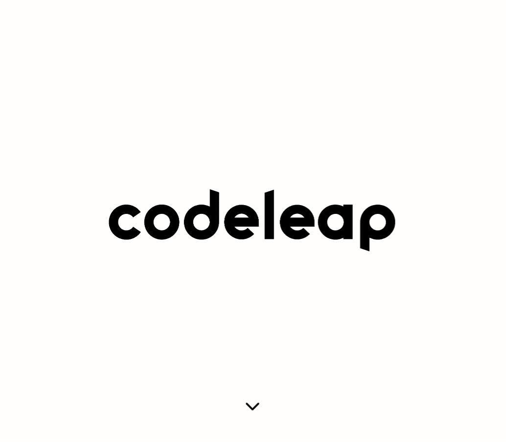
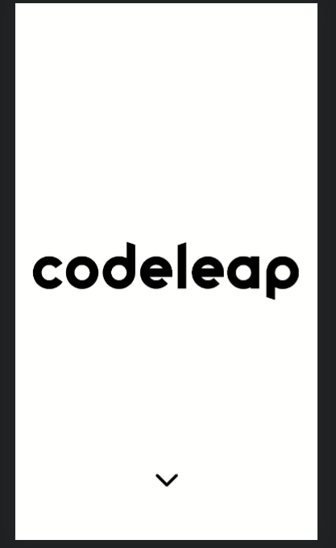

<div align="center" id="top"> 
  <h1>Desktop</h1>
  
  <br>
  <br>
  <h1>Responsive</h1>
  

&#xa0;

<a href="https://codeleap-code-test-wsasouza.vercel.app/">Demo</a>

</div>

<h1 align="center">Codeleap Code Test</h1>

<p align="center">
  

  

  

  
  
</p>

<p align="center">
  <a href="#dart-about">About</a> &#xa0; | &#xa0; 
  <a href="#sparkles-features">Features</a> &#xa0; | &#xa0;
  <a href="#rocket-technologies">Technologies</a> &#xa0; | &#xa0;
  <a href="#white_check_mark-requirements">Requirements</a> &#xa0; | &#xa0;
  <a href="#checkered_flag-starting">Starting</a> &#xa0; | &#xa0;
  <a href="#memo-license">License</a> &#xa0; | &#xa0;
  <a href="https://github.com/wsasouza" target="_blank">Author</a>
</p>

<br>

## :dart: About

The project's goal was to create a very simple application that performs basic CRUD functions in an API.

## :sparkles: Features

:heavy_check_mark: Save username on frontend;\
:heavy_check_mark: List Posts;\
:heavy_check_mark: Create Post;\
:heavy_check_mark: Edit Post;\
:heavy_check_mark: Delete Post;

## :rocket: Technologies

The following tools were used in this project:

- [React](https://pt-br.reactjs.org/)
- [TypeScript](https://www.typescriptlang.org/)
- [Next.js](https://nextjs.org/)
- [TanStack Query](https://tanstack.com/query/v4/)
- [Zustand](https://zustand-demo.pmnd.rs/)
- [React Hook Form v7](https://react-hook-form.com/)
- [Zod](https://zod.dev/)
- [Phosphor Icons](https://phosphoricons.com/)
- [React Toastify](https://www.npmjs.com/package/react-toastify)

## :white_check_mark: Requirements

Before starting :checkered_flag:, you need to have [Git](https://git-scm.com) and [Node](https://nodejs.org/en/) installed.

## :checkered_flag: Starting

```bash
# Clone this project
$ git clone https://github.com/wsasouza/codeleap-code-test

# Access
$ cd codeleap-code-test

# Install dependencies
$ npm install
# or
$ yarn

# Run the project
$ npm run dev
# or
$ yarn dev

# The server will initialize in the <http://localhost:3000>
```

## :memo: License

This project is under license from MIT. For more details, see the [LICENSE](LICENSE.md) file.

Made with :heart: by <a href="https://github.com/wsasouza" target="_blank">Walter Santos de Andrade Souza</a>

&#xa0;

<a href="#top">Back to top</a>
